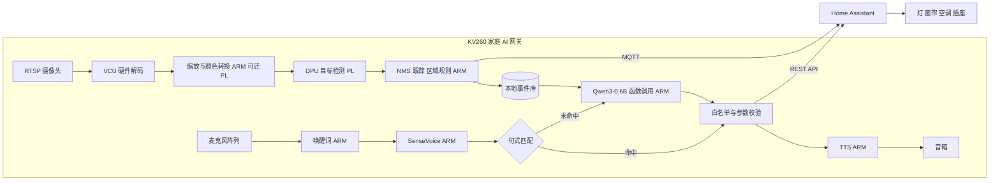

# FPGA 智能家居边缘 AI 方案 v2

版本：v2 · 2026-09-23 · 基于 v1（`FPGA智能家居边缘AI调研_2026-09-22.md`）修订。变更记录见附录 C。

**口径说明（全文统一，不再逐句重复）：** 价格为查阅日官网或渠道标价，不含税运；论文与仓库数据为作者报告，本项目未复现；标注“目标”的是验收要求，标注“估算”的是规划值，均需在对应里程碑实测后替换。

---

## 0. 一页结论

| 项 | 结论 |
|---|---|
| 定位 | **家庭 AI 网关原型**：一台 FPGA 设备接入多路网络摄像头和一套麦克风/音箱，本地完成视觉事件识别与中文语音控制，通过 Home Assistant 执行设备操作。本阶段为原型与技术验证，不是量产产品。 |
| 硬件 | AMD KV260（K26 SOM，4GB DDR4）×2：一块跑主线，一块跑 LLM 硬件研究线（两者的 bitstream 不能同时驻留）。 |
| 视觉 | RTSP 摄像头 → VCU 硬件解码 → PL 上的 DPU 做 INT8 人/宠物检测 → ARM 跟踪与区域规则 → MQTT 上报 Home Assistant。 |
| 语音与控制 | 唤醒词 + SenseVoice-Small 识别 → **规则句式匹配优先，未命中再交给 Qwen3-0.6B 函数调用** → 白名单校验 → Home Assistant 执行 → TTS 播报。 |
| 模型规模 | 7B 是上限，但在 4GB 内存、与视觉和语音同时运行的约束下，**实际可用的语言模型是 0.6B，最多 1.7B**。 |
| 起步方式 | 先用 AMD 官方 Kria 加速应用（smartcam / aibox-reid）跑通板卡，第一周同时实测 A53 上的 LLM 和 ASR 速度。 |
| 周期 | 2026-09-28 启动，主线约 16 周到 2027-01-15；LLM 研究线并行，2027-01-15 做是否继续的评审。 |
| 预算（估算） | 硬件：2 块 KV260 共 $498，另加配件约 ¥2,000–4,500；人力约 33 人周（主线 25 + 研究线 8）。 |
| 最大风险 | ① KV260 的 DPU 工具链已冻结，新版 Vitis AI 只支持 Versal AI Edge；② 4 核 A53 要同时跑 ASR、LLM 和视觉后处理，算力可能不够；③ 官网标注交期 26 周。详见第 10 节。 |

---

## 1. 项目定位与部署形态

### 1.1 为什么是“网关”而不是“每个摄像头一块 FPGA”

家庭里实际使用的多是网络摄像头（RTSP/ONVIF），不是 USB 摄像头。更合理的形态是**一台本地 AI 网关接入 2–4 路摄像头**：

- K26 带 H.264/H.265 硬件编解码单元（VCU），可以把多路视频解码交给硬件，给 ARM 留出算力。AMD 官方的 aibox-reid 应用就是多路 RTSP 解码 + 行人检测 + ReID，与本项目场景接近。[AIBox-ReID 文档](https://xilinx.github.io/kria-apps-docs/kv260/2022.1/build/html/docs/aibox-reid/aibox_landing.html)
- 所有视频和语音在本地处理，不上云，这既是隐私卖点，也是本地 AI 相对云方案的核心价值。
- Home Assistant 运行在另一台设备（现有 PC、NAS 或树莓派）上，不与 KV260 争内存和 CPU。

USB UVC 摄像头仍保留，只用于第一周调试。

### 1.2 与量产的距离

KV260 是开发套件。量产需要 K26 SOM 加自研底板，商业级 K26 SOM 渠道标价约 $325。[DigiKey](https://www.digikey.com/en/products/detail/amd/SM-K26-XCL2GC/13985266)、[AMD K26C](https://www.amd.com/en/products/system-on-modules/kria/k26/k26c-commercial.html) 单板 BOM 远高于消费级智能家居设备，因此：

- 本阶段的目标是验证技术路线和积累 FPGA 部署能力，不以成本作为验收指标；
- 若后续转产品，定位应是高端家庭中枢或行业场景（养老看护、民宿、小型商铺），并在第 7.3 节的迁移路线中重新选型。

---

## 2. 系统架构



### 各部分实际运行位置

| 模块 | 运行位置 | 说明 |
|---|---|---|
| 视频解码 | VCU（硬件编解码单元） | 不占 ARM |
| 目标检测 | PL 上的 DPU | 本项目“FPGA 推理”的主体 |
| 图像预处理 | 先放 ARM，成为瓶颈后迁 PL（HLS） | 迁移前后保持像素格式、letterbox、归一化一致 |
| NMS、跟踪、事件规则 | ARM | |
| 唤醒词、VAD、ASR、TTS | ARM（sherpa-onnx） | 本阶段不做 PL 加速 |
| 语言模型 | ARM（llama.cpp） | 路线 B 研究线验证 PL 加速，见第 6 节 |
| 设备执行 | Home Assistant | KV260 不直接对接 Zigbee/Matter 设备 |

**主线的 FPGA 工作量主要在视觉和预处理上；LLM 在主线中是 CPU 推理，文档和演示中应如实写明。**

---

## 3. 视觉感知

### 3.1 场景（第一期只做两个）

1. 门口有人进入设定区域或停留超过阈值，生成事件；
2. 客厅有人/宠物进入禁入区域，生成事件；另外输出“客厅无人持续 N 分钟”状态，供 HA 自动化（如自动关灯）使用。

用“检测 + 跟踪 + 规则”构建事件，不用 VLM 逐帧解释。快递包裹、陌生人识别、跌倒检测放到基础链路稳定之后：包裹需要补充场景数据；陌生人需要身份比对；跌倒需要时序和姿态。

### 3.2 模型

| 模型 | 用途 | 部署情况 | 顺序 |
|---|---|---|---|
| aibox-reid / smartcam 自带检测模型 | 跑通链路、得到第一版基线 | 官方应用直接加载 | M0 |
| SSD-MobileNetV2 | 人/猫/狗检测基线 | Vitis AI 3.5 Model Zoo 收录；需确认有 KV260 对应包 | M1 |
| YOLOX-Nano（约 0.91M，416×416） | 轻量检测候选 | Vitis AI 3.5 有量化包，但预编译目标为 VEK280/V70，需自行为 KV260 的 DPU 编译 | M1 |
| YOLOv5n（约 1.9M，640×640） | 训练对照 | 无官方 KV260 预编译包 | M1 按需 |

依据：[Vitis AI 3.5 模型列表](https://github.com/Xilinx/Vitis-AI/tree/v3.5/model_zoo/model-list)、[YOLOX-Nano 清单](https://raw.githubusercontent.com/Xilinx/Vitis-AI/v3.5/model_zoo/model-list/pt_yolox-nano_3.5/model.yaml)、[YOLOX](https://github.com/Megvii-BaseDetection/YOLOX)、[YOLOv5](https://github.com/ultralytics/yolov5)。

两条部署要点：

- **编译时必须使用与所加载 overlay 对应的 DPU arch.json**，指纹不一致时模型无法加载。沿用官方应用的 overlay 时，要按它的 DPU 配置和 Vitis AI 版本编译。
- 选定的 checkpoint 要用 Model Inspector/编译器检查是否有子图回退到 CPU。主要计算回退 CPU 时，先换结构或 checkpoint。[Model Zoo 使用说明](https://xilinx.github.io/Vitis-AI/3.5/html/docs/workflow-model-zoo.html)

### 3.3 验收（目标）

| 项 | 目标 |
|---|---|
| 输入 | 2 路 1080p RTSP；网络输入尺寸按模型固定 |
| 检测帧率 | 每路 ≥10fps；分别记录解码、推理、事件三个帧率 |
| 延迟 | 帧到达至检测结果 p95 ≤200ms（停留判定窗口另计） |
| 准确率 | 本地白天/夜间/逆光/遮挡样本分别统计漏检、误检、事件误报次数/小时 |
| 量化损失 | 相对同一 checkpoint 的浮点基线，检测指标下降 ≤2 个百分点 |
| 稳定性 | 连续运行 72 小时，记录掉帧、内存变化、温度、重启 |
| 功耗 | 电源输入端整板功耗，注明是否含摄像头、风扇 |
| HA 接入 | 事件以 MQTT 实体出现在 HA 中，可直接用于自动化 |

---

## 4. 语音与设备控制（v2 新增）

### 4.1 链路与模型

| 环节 | 选型 | 说明 |
|---|---|---|
| 音频前端 | 带板载回声消除/降噪的 USB 麦克风阵列 | TTS 播放时仍要能打断和唤醒，需要 AEC；在 ARM 上自己做 AEC 会增加 CPU 负担 |
| 唤醒词 | sherpa-onnx KWS（zipformer 中英模型，约 3M 参数） | 支持开放词表，自定义中文唤醒词无需重新训练。openWakeWord 以英文为主，中文唤醒词需要自行训练。[sherpa-onnx KWS](https://k2-fsa.github.io/sherpa/onnx/kws/index.html) |
| VAD + ASR | Silero VAD + **SenseVoice-Small**（234M，非流式，int8） | 中文/粤语/英文，sherpa-onnx 支持 ARM 部署。家居命令短，“VAD 截断后整句识别”即可。[SenseVoiceSmall](https://huggingface.co/FunAudioLLM/SenseVoiceSmall)、[sherpa-onnx SenseVoice](https://k2-fsa.github.io/sherpa/onnx/sense-voice/index.html) |
| 意图 | 句式匹配 → Qwen3-0.6B 函数调用（非思考模式） | 见 4.2 |
| TTS | sherpa-onnx 支持的中文 TTS 模型，M2 比较音质与实时率后选定 | [sherpa-onnx](https://k2-fsa.github.io/sherpa/onnx/index.html) |

SenseVoice 官方报告的速度是在 GPU 上测得的，**A53 上的实时率必须在 M0 实测**。如果单句识别超过 1 秒，改用更小的流式模型（如 zipformer/paraformer 小模型）。

### 4.2 控制链路：规则优先，LLM 兜底

```text
识别文本
 ├─ 句式匹配命中（“打开客厅灯”“空调调到26度”）→ 直接生成调用
 └─ 未命中（“有点暗”“我要睡了”“下午门口来过人吗”）
      → Qwen3-0.6B：输入 = 固定系统提示 + 工具定义 + 当前房间设备清单 + 用户话语
      → 输出 JSON 函数调用
 → 白名单与参数校验 → HA REST API 执行 → TTS 播报结果
```

- **常用命令由规则处理，速度快、结果确定**；LLM 只处理模糊表达和事件查询，这样在 A53 上的慢速推理只影响少数请求。
- A53 上的主要延迟来自 **prefill**：工具定义加设备清单可能有数百 token。要在 llama.cpp 中复用固定前缀的 KV 缓存（系统提示 + 工具定义不变），每次只 prefill 用户话语；设备清单只给当前房间的，并控制长度。
- 事件查询（“今天下午门口来过人吗”）：从本地事件库查出结构化记录，再交给 LLM 生成一句中文回答。纯文本 Qwen3 看不到图像，只能读事件记录。
- 执行统一走 HA REST API（`POST /api/services/<domain>/<service>`，使用长期访问令牌）。[HA REST API](https://developers.home-assistant.io/docs/api/rest/)
- 视觉事件通过 MQTT 上报，并使用 HA 的 MQTT 自动发现生成实体。[HA MQTT](https://www.home-assistant.io/integrations/mqtt/)
- 后续可选：把 KV260 上的唤醒词/STT/TTS 以 Wyoming 协议暴露给 HA，复用 HA 的语音卫星设备。Wyoming 支持唤醒词、STT、TTS 等服务，通过主机地址和端口接入。[HA Wyoming](https://www.home-assistant.io/integrations/wyoming/)

### 4.3 安全分级

| 等级 | 示例 | 语音/LLM 权限 |
|---|---|---|
| L0 查询 | 设备状态、事件记录 | 直接执行 |
| L1 低风险 | 灯、窗帘、场景、空调（16–30°C 范围内） | 执行后播报结果 |
| L2 中风险 | 大功率插座、关闭摄像头、离家模式 | 必须语音二次确认 |
| L3 高风险 | 门锁开锁、燃气阀、安防撤防 | **不向 LLM 暴露这些工具**，只能在 App 中手动操作 |

校验层独立于 LLM：`entity_id` 必须在白名单中，参数必须在允许范围内，工具必须在允许列表中。任何校验失败都拒绝执行并播报原因。

### 4.4 验收（目标）

| 项 | 目标 |
|---|---|
| 唤醒 | 3 米、安静环境下唤醒率 ≥95%；误唤醒 ≤1 次/24 小时（播放电视背景音测试） |
| 命令正确率 | 自建 150 条中文指令测试集（含方言化和模糊表达）≥90% |
| 越权 | 白名单外调用和 L3 调用拦截率 100% |
| 延迟 | 说完到设备动作 p95：规则路径 ≤1.5s，LLM 路径 ≤4s |
| 并发 | 语音交互期间，视觉检测帧率下降不超过 30% |

LLM 路径达不到 4s 时的退路：LLM 只用于事件查询和回答，控制全部走规则路径加一个小型意图分类模型；同时把该数据作为研究线（PL 加速）立项依据。

---

## 5. 语言模型选型与内存预算

### 5.1 候选

| 模型 | 用途 | 结论 |
|---|---|---|
| **Qwen3-0.6B** | 函数调用、事件问答 | **主线默认**，关闭思考模式 |
| Qwen3-1.7B | 0.6B 正确率不够时升级 | 内存紧张，需在 M2 实测后决定 |
| Qwen3-4B-Instruct-2507、Qwen3.5 系列、Gemma 4 E2B、Phi-4-mini | 能力对照 | 4GB 板上不与视觉、语音同时运行；只作为离线质量对照 |
| TeLLMe 配套 BitNet 0.73B | PL 加速研究 | 研究线复现对象，见第 6 节 |

模型卡：[Qwen3-0.6B](https://huggingface.co/Qwen/Qwen3-0.6B)、[Qwen3-1.7B](https://huggingface.co/Qwen/Qwen3-1.7B)、[Qwen3-4B-Instruct-2507](https://huggingface.co/Qwen/Qwen3-4B-Instruct-2507)、[Qwen3.5-0.8B 配置](https://huggingface.co/Qwen/Qwen3.5-0.8B/raw/main/config.json)、[Gemma 4 E2B](https://huggingface.co/google/gemma-4-E2B-it)、[Phi-4-mini](https://huggingface.co/microsoft/Phi-4-mini-instruct)。

Qwen3.5 包含线性注意力、卷积状态和视觉模块，参数小并不代表更容易映射到现有 FPGA 核；Gemma 4 E2B 的 2.3B 是有效参数，含 embedding 为 5.1B。

### 5.2 4GB 内存预算（估算，M0 后替换为实测）

| 项 | 规划值 |
|---|---|
| Linux（无桌面）+ 系统服务 | 0.5–0.8 GB |
| 2 路 1080p 解码 + DPU/DMA/CMA 缓冲 | 0.5–1.0 GB |
| 视觉模型 + 运行时 | 0.1–0.3 GB |
| KWS + VAD + SenseVoice-Small int8 | 0.3–0.5 GB |
| TTS | 0.1–0.3 GB |
| Qwen3-0.6B Q4 + KV 缓存（1024 token，FP16 约 112 MiB） | 0.5–0.7 GB |
| 应用服务（MQTT、事件库、Python 进程） | 0.2–0.4 GB |
| **合计** | **2.2–4.0 GB** |

KV 缓存按 Qwen3-0.6B 配置计算：2 × 28 层 × token 数 × 8 个 KV 头 × 128 × 2 字节。[配置](https://huggingface.co/Qwen/Qwen3-0.6B/raw/main/config.json)

结论：0.6B 可以放下；换 1.7B（Q4 权重多约 0.6–0.8GB）后，上限会超过 4GB。所以升级 1.7B 的前提是 M0 实测的占用落在区间下半部分。**KV260 的 4GB 在 SOM 上，换载板不会增加内存。**

---

## 6. LLM 的 FPGA 加速研究线（路线 B）

### 6.1 已有工作（作者报告，不作横向排名）

| 工作 | 平台与模型 | 报告结果 | 对本项目的意义 |
|---|---|---|---|
| **TeLLMe v2** | KV260，BitNet 0.73B，W1.58A8 | 峰值 25 tok/s；64–128 token 输入 TTFT 约 0.45–0.96s；4.8W | **首选复现对象**。[论文](https://arxiv.org/html/2510.15926v1) |
| TeLLMe（早期） | KV260，约 0.7B 三值 | 峰值 9.51 tok/s | 与 v2 数据分开引用。[论文](https://arxiv.org/html/2504.16266v2) |
| PD-Swap | KV260，BitNet 0.73B，动态局部重配置 | 约 27 tok/s | 未确认有完整公开部署包。[论文](https://arxiv.org/html/2512.11550v1) |
| llama-fpga | KV260，Llama2-7B AWQ，裸机 | 约 5 tok/s | 7B 且裸机，只作访存设计参考。[仓库](https://github.com/adamgallas/llama-fpga) |
| SECDA-LLM | 小型 FPGA，TinyLlama | llama.cpp 与 MatMul 加速器集成方法 | 若做 Qwen3 移植，可参考其软硬件接口。[论文](https://arxiv.org/html/2408.00462v1) |
| Hummingbird | KV260/ZCU104，Llama3-8B | 4.8/8.6 tok/s | 超出参数范围，只作方法参考。[论文](https://arxiv.org/abs/2507.03308) |

Hummingbird+（DOI 10.1145/3748173.3779189）未取得全文，其成本和吞吐不作为依据。

### 6.2 复现注意事项

- TeLLMe 仓库使用 **BSD-3-Clause** 许可，包含 HLS 源码和 PYNQ 聊天程序；LM head 在 ARM NEON 上运行；**底座模型未做对话微调**。[仓库](https://github.com/UCI-CORSA/TeLLMe_FPGA_2026)
- **权重和缓存托管在 Google Drive，国内访问可能不稳定**。M0 期间应下载完成，记录校验值，并在内部存储备份。
- 使用 Vitis HLS/Vivado 2024.1，与主线的 DPU 工具链是两套独立环境。
- 资源冲突：TeLLMe v2 约使用 98K LUT、610 DSP、60 个 URAM，而 K26 总共只有 64 个 URAM。**它不能与视觉 DPU 同时驻留**，这也是配两块板的原因。若将来要合并，只能缩小两个核、分时切换或动态局部重配置。[K26 规格](https://www.amd.com/en/products/system-on-modules/kria/k26/kv260-vision-starter-kit.html)

### 6.3 继续/停止判定（2027-01-15 评审）

复现 TeLLMe v2 并记录 TTFT、decode 速度、功耗和 ARM/PL 分工。满足以下条件，才投入 Qwen3 的 PL 移植：

1. 复现数据与论文偏差在可解释范围内；
2. 主线 M2 的 LLM 路径达不到 4 秒目标，或 CPU 争用影响了视觉；
3. 有明确的方案解决与视觉 DPU 的资源共存问题。

---

## 7. 板卡与工具链

### 7.1 板卡

| 板卡 | 规格与标价 | 用途 |
|---|---|---|
| **AMD KV260** | K26，4GB DDR4，带 VCU；$249，电源另购；官网标注交期 26 周 | **主线与研究线各一块**。[官方页面](https://www.amd.com/en/products/system-on-modules/kria/k26/kv260-vision-starter-kit.html) |
| AMD KR260 | 同为 K26、4GB；$349 | 只在需要多网口时考虑，不是算力或内存升级。[官方页面](https://www.amd.com/en/products/system-on-modules/kria/k26/kr260-robotics-starter-kit.html) |
| AMD ZCU104 | ZU7EV；$1,678 | 如已有可用于研究，不新购。[官方页面](https://www.amd.com/en/products/adaptive-socs-and-fpgas/evaluation-boards/zcu104.html) |
| AMD VEK280 | Versal AI Edge VE2802，AIE-ML；$6,995 | 新版 Vitis AI 的正式支持平台，见 7.3。[官方页面](https://www.amd.com/en/products/adaptive-socs-and-fpgas/evaluation-boards/vek280.html) |
| VE2302 第三方板卡 | Trenz TE0950（8GB DDR4）、ALINX VD100、Tria VE2302 套件 | 成本较低的 Versal AI Edge 选项，但 Vitis AI 6.2 的正式支持列表中没有列出 VE2302。[TE0950](https://www.trenz-electronic.de/en/AMD-Versal-AI-Edge-Evalboard-with-VE2302-device-8-GB-DDR4-SDRAM-15-x12-cm/TE0950-03-EGBE21C)、[ALINX VD100](https://www.en.alinx.com/Product/SoC-Development-Boards/Versal-AI-Edge/VD100.html) |
| Lattice、Altera | Lattice 适合超低功耗前级；Altera FPGA AI Suite 2026.1.1 官方答复暂不支持 LLM/Transformer | 本阶段不采用。[Altera 社区答复](https://community.altera.com/discussions/acceleration/is-spatial-ip-ready-for-llm--transformer-inference/353202) |

交期风险：AMD 官网标注 26 周。下单前向 DigiKey、Mouser、国内代理核实现货；如果 10 月 9 日前无法到货，整个排期顺延。已有国内 Zynq UltraScale+ 板卡（带 VCU 的 EV 系列器件）的，可先用它开展 M0。

### 7.2 工具链：选定一套，冻结版本

| 用途 | 版本 | 说明 |
|---|---|---|
| M0 快速启动 | Kria 官方加速应用（smartcam、aibox-reid），通过 `xmutil loadapp` 加载 | 官方文档基于 2022.1；在 Ubuntu 22.04 上运行需先升级板载固件。记录所装应用对应的 Vitis AI 版本和 DPU 配置。[smartcam](https://www.amd.com/en/developer/resources/kria-apps/smart-camera.html)、[固件升级](https://community.element14.com/technologies/fpga-group/b/blog/posts/kria-kv260-kr260-firmware-update-for-booting-ubuntu-22-04) |
| M1 起自建视觉平台（按需） | Vitis AI 3.5 + Vivado/Vitis/PetaLinux 2023.1 | 需要 3.5 Model Zoo 中的模型或自定义 DPU 配置时才迁移 |
| 研究线 | Vitis HLS/Vivado 2024.1 | 与主线分开的环境 |

原则：在同一块板上，overlay、DPU 配置、Vitis AI 版本和模型编译版本必须一一对应；每次升级都在版本清单中记录。

### 7.3 工具链生命周期风险与迁移路线

- Vitis AI 3.5 起，Zynq UltraScale+ 的 DPU（DPUCZDX8G）被 AMD 定为“成熟”IP，不再随新版本更新。[Vitis AI 3.5 发行说明](https://xilinx.github.io/Vitis-AI/3.5/html/docs/reference/release_notes.html)、[DPU IP 说明](https://xilinx.github.io/Vitis-AI/3.5/html/docs/workflow-system-integration.html)
- 新的 Vitis AI 5.x/6.x 改用 NPU 架构（PL + AIE-ML）。Vitis AI 6.2 的正式支持范围是 Versal AI Edge 和 Versal AI Edge Gen 2，评估板为 VEK280 和 VEK385。[Vitis AI 6.2](https://vitisai.docs.amd.com/en/6.2/) Zynq UltraScale+ 是否会支持 NPU，AMD 公开资料的说法是联系销售。[MicroZed Chronicles](https://www.adiuvoengineering.com/post/microzed-chronicles-vitis-ai-and-the-npu)

应对：

1. **原型阶段继续使用 KV260**：工具链冻结不影响技术验证，但要把镜像、docker、模型和工程完整归档，避免日后无法重建。
2. **产品化或长期维护转向 Versal AI Edge**：M3 结束时，评估把视觉模型迁移到 Vitis AI 6.x NPU 的工作量。VE2302 板卡是否受支持，需要向 AMD 或板卡厂商确认。
3. 应用层（事件、语音、HA 接入）与推理后端解耦，推理后端通过统一接口调用，迁移时只替换后端。

---

## 8. 里程碑与验收

起始日期 2026-09-28，已计入国庆假期。日期是计划值；硬件到货时间决定实际起点。

| 里程碑 | 时间 | 内容 | 通过条件 |
|---|---|---|---|
| **M0 环境与基线** | 09-28 → 10-23 | 采购到货；升级固件；运行 smartcam 和 aibox-reid；**在 A53 上实测 Qwen3-0.6B（llama.cpp，Q4）的 TTFT、tok/s、内存，以及 SenseVoice 的实时率**；下载并备份 TeLLMe 数据；确认 Vivado 许可和器件支持 | 官方应用可以接入 RTSP 并输出检测结果；以上实测数据写入基线表；第 5.2 节预算改为实测值 |
| **D1 决策评审** | 10-23 | 根据 A53 实测数据，确定 LLM 路径在主线中的范围（控制+查询，或只做查询） | 形成书面结论 |
| **M1 视觉事件链路** | 10-26 → 11-20 | 2 路 RTSP；比较检测模型并检查算子；跟踪与区域规则；本地事件库；MQTT 接入 HA | 第 3.3 节指标（72 小时稳定性放到 M3） |
| **M2 语音与设备控制** | 11-23 → 12-18 | 唤醒词、VAD、ASR、规则匹配、Qwen3 函数调用、白名单校验、HA REST、TTS；150 条指令测试集 | 第 4.4 节指标 |
| **M3 联调与优化** | 12-21 → 2027-01-15 | 视觉与语音并发；预处理成为瓶颈时做 HLS 迁移；72 小时稳定性；整机功耗；Versal 迁移评估 | 全部指标复测通过；形成可复现部署包 |
| **R 研究线** | 11-02 → 2027-01-15（第二块板） | 复现 TeLLMe v2；记录 TTFT、decode、功耗、ARM/PL 分工 | 第 6.3 节继续/停止评审 |

可复现部署包包括：环境版本清单、模型来源与校验值、校准数据说明、arch.json、硬件 Tcl、约束文件、bitstream/平台描述、推理与应用程序、测试集与测试记录。

---

## 9. 预算（估算）

### 9.1 硬件

| 项 | 数量 | 单价 | 备注 |
|---|---|---|---|
| AMD KV260 | 2 | $249 | 官网标价，不含税运 |
| KV260 电源 | 2 | 按渠道报价 | 官方配件包或兼容适配器 |
| microSD 64GB | 3 | ¥50 | 多一张用于镜像备份 |
| USB UVC 摄像头 | 1 | ¥100–300 | 调试用 |
| 网络摄像头（支持 RTSP/ONVIF 本地拉流） | 2 | ¥200–500 | 很多消费级摄像头不开放 RTSP，采购前确认 |
| USB 麦克风阵列（板载 AEC/降噪） | 1 | ¥300–800 | |
| 小音箱 | 1 | ¥50–200 | |
| 可由 HA 本地控制的灯/插座/窗帘电机 + Zigbee 适配器 | 1 套 | ¥300–800 | 用于端到端测试 |
| 功率计 | 1 | ¥100–300 | 测整板功耗 |
| HA 主机 | 1 | ¥0–900 | 优先使用现有 PC/NAS |
| **配件合计** | | **约 ¥2,000–4,500** | 另加 2 块 KV260（$498） |

软件：Vivado ML Standard（免费版）、Vitis AI、sherpa-onnx、llama.cpp、Home Assistant 均无需付费许可。K26 器件在免费版 Vivado 中的支持情况，需在 M0 按所用版本确认。

### 9.2 人力（人周）

| 里程碑 | 嵌入式/FPGA | 视觉算法 | 应用/语音 | 小计 |
|---|---|---|---|---|
| M0 | 2 | 0.5 | 0.5 | 3 |
| M1 | 2 | 4 | 2 | 8 |
| M2 | 1 | 1 | 6 | 8 |
| M3 | 3 | 1 | 2 | 6 |
| R | 8 | — | — | 8 |
| **合计** | 16 | 6.5 | 10.5 | **33** |

按 2–3 人配置可以在 16 周内完成。人力是主要成本。

---

## 10. 团队技能

| 角色 | 必需技能 | 主要投入阶段 |
|---|---|---|
| 嵌入式/FPGA | Kria/PetaLinux/Ubuntu 板级环境，设备树与 overlay，VCU/GStreamer；研究线需要 Vitis HLS、Vivado 时序收敛、AXI/DMA 调试 | M0、M3、R |
| 视觉算法 | 检测模型训练与微调，Vitis AI 量化与编译，算子检查，数据集标注 | M1 |
| 应用/语音 | Python/C++，sherpa-onnx，llama.cpp，提示词与函数调用，MQTT，HA API，测试集建设 | M2 |

主线 M0–M2 基本不需要自己改 Vivado 工程（沿用官方 overlay 或 Vitis AI 参考平台）。深度的 HLS/Vivado 工作集中在 M3 的预处理迁移和研究线。团队缺少 HLS 经验时，研究线可以推迟，不影响主线。

---

## 11. 风险清单

| # | 风险 | 可能性 | 影响 | 应对 |
|---|---|---|---|---|
| R1 | KV260 DPU 工具链冻结，新版 Vitis AI 不支持 | 已确定 | 中（原型）/高（产品） | 完整归档环境；推理后端解耦；M3 做 Versal 迁移评估（7.3） |
| R2 | KV260 交期长（官网 26 周） | 中 | 高 | 多渠道查现货；已有 Zynq US+ EV 板卡的先用；10-09 前未到货则顺延排期 |
| R3 | A53 算力不足，ASR、LLM、后处理争用 CPU | 高 | 高 | M0 实测；VCU 硬件解码；规则路径优先；语音交互时降低检测帧率；D1 缩小 LLM 范围 |
| R4 | 4GB 内存不够 | 中 | 中 | 5.2 节预算 M0 实测；限制上下文长度；不运行桌面环境；1.7B 需实测后决定 |
| R5 | LLM 误操作设备 | 中 | 高 | 安全分级（4.3）；独立校验层；L3 不暴露给 LLM；越权拦截率 100% 作为验收项 |
| R6 | 检测模型算子不支持，回退 CPU | 中 | 中 | Model Inspector 预检；优先使用有 KV260 包的模型 |
| R7 | 官方 Kria 应用版本较老，与 Ubuntu 22.04 或新模型不兼容 | 中 | 低 | 按文档锁定版本；必要时迁移到 VAI 3.5 自建平台 |
| R8 | 摄像头不开放 RTSP，或编码格式不兼容 | 中 | 低 | 采购前确认 RTSP/ONVIF 和 H.264/H.265 |
| R9 | TeLLMe 数据下载失败；底座模型不是对话模型 | 中 | 中（研究线） | M0 内下载并备份；研究线只测性能，不以对话质量验收 |
| R10 | 家庭场景数据的隐私与授权 | 中 | 中 | 采集前取得书面同意；数据只存本地并加密；测试集脱敏 |
| R11 | 量产成本过高 | 高 | 本阶段低 | 定位为原型与技术验证；产品化另行立项并重新选型 |

---

## 附录 A：对 v1 原稿说法的核查（原 v1 第 2 节）

| 原稿中的表述 | 核查结论 |
|---|---|
| KV260 + Qwen3 可直接作为 FPGA LLM 起点 | 已核查的 llama-fpga/TeLLMe 工程没有证明“换权重即可部署 Qwen3” |
| llama-fpga 在 KV260 上约 5 tok/s | 对应 Llama2-7B AWQ、裸机，不能外推到 Linux + Qwen3 + 摄像头 |
| BitNet 0.73B 为 9–27 tok/s | 数据分别来自 TeLLMe、TeLLMe v2、PD-Swap，需分开引用 |
| Gemma 4 E2B 约 2.3B | 2.3B 为有效参数，含 embedding 为 5.1B |
| 30B-A3B 属于 7B 以下 | 30B 是总参数，不在范围内 |
| Transformer LLM 只是带宽瓶颈 | decode 常受访存限制，prefill 还受计算和调度影响；TTFT 和 tok/s 都要测 |
| FPGA 片上存储十几 MB | K26 的 BRAM+URAM 合计约 2.9 MiB |
| DPU 视觉与 LLM 核可一起部署 | 资源冲突，需要重新综合验证 |
| 常开感知约 7mW | Lattice 示例条件为 64×64、VGG8、5fps，不代表高清摄像头系统 |
| 增加内存比增加 LUT 更重要 | 容量、带宽、算子资源都重要 |
| 视觉 demo 几天、控制 1–3 秒 | 只能作为目标，已改为第 8 节的里程碑和第 4.4 节的验收 |

## 附录 B：证据与待核验事项

使用了官方厂商页面、官方模型卡、原始论文和作者仓库；搜索摘要只用于发现线索。arXiv API 访问失败，改用 arXiv 官方 HTML/摘要页核查，失败记录见 `检索记录.json`。

M0 期间需核验：KV260 现货与电源型号；官方 Kria 应用对应的 Vitis AI 版本与 DPU 配置；A53 上 Qwen3-0.6B 与 SenseVoice 的实测性能；实际内存占用；K26 在免费版 Vivado 中的支持；所购网络摄像头的 RTSP 兼容性；TeLLMe 数据包的可获取性。

## 附录 C：v1 → v2 变更

1. 新增一页结论、里程碑（带日期）、预算、团队技能、风险清单。
2. 定位改为家庭 AI 网关：RTSP 多路输入，使用 VCU 硬件解码；补充与量产的距离。
3. 新增语音与设备控制：唤醒词、ASR、TTS，Home Assistant 接入，规则优先 + LLM 函数调用，安全分级。
4. 新增工具链生命周期风险（DPU 冻结、Vitis AI 6.x 只支持 Versal AI Edge）及迁移路线。
5. M0 改为从 Kria 官方加速应用起步；A53 上的 LLM/ASR 实测从 v1 第 5 步提前到第 1 周。
6. 明确 4GB 约束下实际可用的模型规模为 0.6B（最多 1.7B），并给出整机内存预算。
7. 补充 TeLLMe 的许可、非对话模型、Google Drive 获取风险；硬件改为两块 KV260，主线和研究线并行。
8. 原稿核查表移到附录 A；口径说明统一放在文首，正文减少逐句的限定语。
9. 按用户要求，本版不设非 FPGA 对照组。
