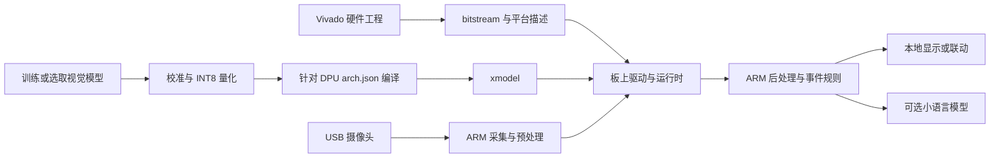

# FPGA 智能家居边缘 AI：模型、板卡与部署路线

调研日期：2026-09-22。依据用户提供的初稿核查，并按补充需求调整为“摄像头感知优先；同时评估 ARM/FPGA 混合推理与 LLM 的 PL 加速”。

本文是选型研究，未进行板卡实测、模型量化或 Vivado 综合。官方规格、作者报告的数据与本文的工程建议分别标明；价格为查阅当日网页标价，不是国内含税到手价。

## 1. 建议采用的起点

**第一阶段选择 KV260 + USB UVC 摄像头 + INT8 视觉检测模型，在 FPGA 的 PL 上运行视觉推理，ARM 负责采集、检测后处理、跟踪和事件逻辑。** 先完成“人/宠物检测 → 区域入侵/停留事件 → 本地显示或设备联动”。

7B 是模型规模上限，不是摄像头任务的目标规模。目标检测通常可以从百万参数级网络开始；逐帧感知不必经过语言模型。第二阶段如需要“解释发生了什么”“用中文查询事件”，再增加 Qwen3-0.6B/1.7B。若需要直接问图，再独立评测多模态模型。

上述选型是基于现有资源和部署证据的工程建议。KV260 的官方 DPU-PYNQ 支持记录可查，但其旧工程已经归档，不能理解为当前任意工具版本都可直接安装成功。[DPU-PYNQ 官方仓库](https://github.com/Xilinx/DPU-PYNQ)

### 两条路线都保留

| 路线 | PL（可编程逻辑）运行什么 | ARM 运行什么 | 对当前需求的优先级 |
|---|---|---|---|
| A：感知优先 | DPU 上的视觉 CNN；后续增加图像预处理 | 摄像头采集、NMS、跟踪、事件规则；可选小 LLM | **第一阶段主线** |
| B：LLM 的 FPGA 加速 | 自定义 Transformer/三值模型计算核 | 调度、分词、采样及尚未迁移的算子 | 第二阶段研究线，单独验证资源与延迟 |

路线 A 中，视觉网络确实在 FPGA 上推理；如果 LLM 用 ARM 运行，应明确记录为 CPU 推理。路线 B 也不意味着所有算子都在 PL，必须记录每个算子的实际执行位置。

## 2. 对原稿的主要修订

| 原稿中的表述 | 核查后的结论 | 对项目的影响 |
|---|---|---|
| KV260 + Qwen3 可直接作为 FPGA LLM 起点 | Qwen3 有软件支持，但已核查的 llama-fpga/TeLLMe 工程没有证明“换权重即可部署 Qwen3” | Qwen3 列为应用候选与 PL 移植目标，不列为开箱即用 PL 模型 |
| llama-fpga 在 KV260 上约 5 tok/s | 作者仓库确有此报告，目标是 Llama2-7B AWQ；嵌入式演示采用裸机平台 | 不能外推成 Linux + Qwen3 + 摄像头的吞吐。[作者仓库](https://github.com/adamgallas/llama-fpga) |
| BitNet 0.73B 为 9–27 tok/s | 来自不同版本/设计：早期 TeLLMe、TeLLMe v2、PD-Swap | 必须逐条注明论文、模型和阶段，见第 5 节 |
| Gemma 4 E2B 约 2.3B | 官方写的是有效参数 2.3B，含 embedding 为 5.1B，并单列视觉/音频编码器 | 容量预算不能只按 2.3B 计算。[官方模型卡](https://huggingface.co/google/gemma-4-E2B-it) |
| 30B-A3B 属于 7B 以下候选 | 3B 是激活参数，30B 是总参数 | 本调研按总参数 <7B 筛选；30B MoE、7B/8B 不列入主推荐 |
| Transformer LLM 是带宽瓶颈，不是算力瓶颈 | 单请求 decode 往往受权重/KV 访存限制；prefill 还明显受计算、注意力和调度影响 | 同时测首 token 延迟和生成速度，不能只看 tok/s。[PD-Swap](https://arxiv.org/html/2512.11550v1) |
| FPGA 片上存储十几 MB | 不能泛化到 K26；其 144 个 BRAM、64 个 URAM，按块容量合计约 2.9 MiB，尚未扣除占用 | 小 FPGA 的片上缓存更加紧张。[KV260 官方规格](https://www.amd.com/en/products/system-on-modules/kria/k26/kv260-vision-starter-kit.html) |
| DPU 视觉与 LLM 核一起部署 | 需要重新综合验证，现有论文核已使用大量片上资源 | 不能将两个独立 bitstream 当成可同时驻留的硬件 |
| 常开感知约 7mW | Lattice 官方示例条件是 64×64×3、VGG8、5fps；并非完整高清摄像头系统的通用功耗 | 只作为专用低分辨率感知参考。[Lattice 白皮书](https://www.latticesemi.com/-/media/LatticeSemi/Documents/WhitePapers/NZ/WP0019_Lattice_sensAI_10X_Boost_Whitepaper.ashx?document_id=52716) |
| 增加内存比增加 LUT 更重要 | 容量、有效带宽和算子资源都重要；只增加容量不会自动提高 tok/s | 量产板应同时检查 DDR 通道、位宽、频率和 PS/PL 通路 |
| 视觉 demo 几天、控制 1–3 秒 | 可以作为目标，无法作为本项目的已验证结果 | 增加环境搭建、模型适配和端到端验收关口 |

原稿所述 Hummingbird+ 有对应论文记录（DOI：10.1145/3748173.3779189），但本次没有成功取得出版社全文，24GB、<$150 BOM、18 tok/s 等细节未在可读取的一手全文中完成核验。因此不将它列为可采购板卡，也不据此承诺价格或性能。[出版社入口](https://dl.acm.org/doi/10.1145/3748173.3779189)

## 3. 摄像头模型选型

### 3.1 候选模型及部署证据

| 模型 | 规模/输入 | 适合任务 | FPGA 部署证据与限制 | 建议 |
|---|---|---|---|---|
| **SSD-MobileNetV2** | 百万参数级，具体尺寸按 checkpoint | 人、猫、狗等检测 | Vitis AI 3.5 有模型条目；本次未核验具体下载包是否包含匹配 KV260 的 xmodel | 优先做 DPU 编译与图像效果验证 |
| **YOLOX-Nano** | 上游约 0.91M，416×416 | 轻量人/宠物检测 | Vitis AI 3.5 有浮点/量化包，但该清单的预编译目标是 VEK280、V70，未列 KV260 | 有吸引力的优化候选；必须检查 DPUCZDX8G 算子映射 |
| **YOLOv5n** | 上游约 1.9M，典型输入 640×640 | 通用目标检测、训练对照 | 有成熟训练代码；本次未找到可直接采用的官方 KV260 预编译组合 | 模型适配与训练候选，不预先承诺可直接上板 |
| MobileNetV1/V2/V3 分类网络 | 百万参数级；宽度可缩放 | 裁剪区域的有人/无人或物品状态分类 | Vitis AI 3.5 收录多个版本 | 简化任务时使用；分类网络不会直接输出目标框 |
| ResNet50 示例 | 中等规模分类网络 | 验证 overlay、驱动、模型运行链路 | DPU-PYNQ 附带相关 notebook | 只用于入门通路验证，不作为家居最终检测器 |

模型依据：[Vitis AI 3.5 模型列表](https://github.com/Xilinx/Vitis-AI/tree/v3.5/model_zoo/model-list)、[YOLOX-Nano 官方目标清单](https://raw.githubusercontent.com/Xilinx/Vitis-AI/v3.5/model_zoo/model-list/pt_yolox-nano_3.5/model.yaml)、[YOLOX 上游参数表](https://github.com/Megvii-BaseDetection/YOLOX)、[YOLOv5 上游](https://github.com/ultralytics/yolov5)、[DPU-PYNQ 示例](https://github.com/Xilinx/DPU-PYNQ/tree/master/pynq_dpu/notebooks)。

模型名字、模型文件格式和 FPGA 支持是三回事。ONNX 能导出，或 Model Zoo 收录了模型，都不足以证明它的所有主要算子能在 K26 的 DPU 上运行。最终选用的 checkpoint 要通过 Model Inspector/编译器检查，核查 CPU 子图与算子回退，再测完整链路。[AMD Model Zoo 使用说明](https://xilinx.github.io/Vitis-AI/3.5/html/docs/workflow-model-zoo.html)

**建议的筛选顺序：先复现官方分类示例确认硬件链路，再用 SSD-MobileNetV2 做检测基线，随后与 YOLOX-Nano/YOLOv5n 比较本地场景精度、算子支持和端到端延迟。** 这是验证顺序，不是已经完成测试的排名。

### 3.2 应用范围

第一期建议选择两个固定场景：

1. 门口有人进入设定区域或停留超过阈值，形成事件。
2. 客厅有人/宠物进入禁入区域，显示状态并触发受控联动。

检测器负责类别、位置和置信度；跟踪器负责跨帧关联；规则负责区域、停留时间、去抖和重复事件合并。用“检测 + 跟踪 + 规则”构建事件链路，通常比要求 VLM 逐帧生成解释更容易评估延迟和误报。

快递包裹并非所有通用数据集的现成类别，需检查标签并补充场景数据；“陌生人”需要身份比对，普通 person 检测不能判定；跌倒需要时间序列、姿态和遮挡验证，不能由某一帧的框直接推出。后两项应放在基础事件链路稳定之后。

### 3.3 建议验收条件（项目目标，不是实测值）

| 项目 | 初始目标/记录方式 |
|---|---|
| 输入 | 单路 720p 或 1080p 摄像头；网络输入单独固定为 300/416/640 等实际支持尺寸 |
| 检测刷新 | 先争取 ≥10fps；记录采集 FPS、推理 FPS、事件 FPS，分别统计 |
| 延迟 | 先争取帧采集到检测结果 p95 ≤200ms；停留判定窗口另外计时 |
| 准确率 | 在本地白天、夜间、逆光、遮挡样本上统计漏检、误检与事件误报/小时 |
| 量化损失 | 与相同 checkpoint 浮点基线对比，初始目标为检测指标下降不超过 2 个百分点 |
| 运行稳定性 | 连续运行 8 小时；记录掉帧、内存变化、温度和重启情况 |
| 功耗 | 测电源输入端整板功耗，注明是否包含摄像头、网络、风扇 |

摄像头原始分辨率不等于网络输入分辨率。小目标如远处包裹，可能更需要提高输入尺寸或做区域裁剪，而非直接换成大语言模型。

## 4. 7B 以下语言/多模态模型

### 4.1 候选及排序理由

| 模型 | 参数口径 | 对本项目的用途 | PL 加速现实性 | 选择意见 |
|---|---|---|---|---|
| **Qwen3-0.6B** | 标称总参数 0.6B | 事件转中文短句、简单事件查询 | 本次未核验到现成 KV260 全模型部署包 | **第一款 ARM 软件基线和后续 PL 移植目标** |
| **Qwen3-1.7B** | 标称 1.7B | 更复杂指令、结构化事件问答 | 同样需要适配 | 0.6B 任务精度不足后升级 |
| Qwen3-4B-Instruct-2507 | 4.0B；非思考模式 | 较复杂事件解释/工具选择 | 4GB 内存下与视觉并行压力明显 | 容量与延迟评估后再考虑 |
| Qwen3.5-0.8B / 2B / 4B | 按官方型号命名；文件预算需统计完整多模态权重 | 图像问答与多模态比较 | 混合线性/全注意力及视觉模块带来额外适配 | 软件质量对照；不作为最初的 PL 移植对象 |
| Gemma 4 E2B | 2.3B 有效；含 embedding 5.1B，另核查编码器统计范围 | 图像/音频/文本理解 | PLE、混合注意力和编码器增加实现工作 | 容量和工具链要求较高，后续候选 |
| Phi-4-mini-instruct | 3.8B | 结构化输出和复杂文本推理对照 | 需要单独适配 | 中文家居场景需实测，没有理由优先于更小 Qwen |
| TinyLlama-1.1B-Chat | 1.1B | 与既有 FPGA 工作做对照 | 有相关加速研究，但不等于任意板卡现成支持 | 硬件研究对照，中文产品优先级较低 |
| TeLLMe 配套 BitNet 0.73B | 论文所用的具体三值模型 | 复现 PL 上的小 LLM 推理 | 作者提供 HLS 与 KV260/PYNQ 运行代码 | **LLM 硬件研究优先复现对象** |
| Microsoft BitNet b1.58 2B4T | 约 2B；原生三值训练 | 三值模型进一步研究 | 架构与 0.73B 实验模型不能视为相同 | 可研究，但不是 TeLLMe 的即插即用升级 |

官方模型依据：[Qwen3-0.6B](https://huggingface.co/Qwen/Qwen3-0.6B)、[Qwen3-1.7B](https://huggingface.co/Qwen/Qwen3-1.7B)、[Qwen3-4B-Instruct-2507](https://huggingface.co/Qwen/Qwen3-4B-Instruct-2507)、[Qwen3.5-2B](https://huggingface.co/Qwen/Qwen3.5-2B)、[Gemma 4 E2B](https://huggingface.co/google/gemma-4-E2B-it)、[Phi-4-mini](https://huggingface.co/microsoft/Phi-4-mini-instruct)、[TinyLlama](https://huggingface.co/TinyLlama/TinyLlama-1.1B-Chat-v1.0)、[BitNet 2B4T](https://huggingface.co/microsoft/bitnet-b1.58-2B-4T)。

Qwen3.5-0.8B 的配置明确包含线性注意力、全注意力、卷积状态与视觉配置。因此“参数更小”不足以说明它比 Qwen3 更容易映射到现有 Llama 类 FPGA 核，这是对官方架构配置的工程判断。[Qwen3.5 配置](https://huggingface.co/Qwen/Qwen3.5-0.8B/raw/main/config.json)

Qwen3-0.6B/1.7B 初始应用建议关闭思考模式，采用短上下文、有限事件和紧凑结构化输出。Qwen3-4B-Instruct-2507 本身是非思考版本。关闭思考能减少不必要输出，但不能保证模型一定正确调用工具。[Qwen3 用法](https://huggingface.co/Qwen/Qwen3-0.6B)、[4B 非思考版本说明](https://huggingface.co/Qwen/Qwen3-4B-Instruct-2507)

纯文本 Qwen3 看不到摄像头图像，只能读取检测器生成的事件，例如“玄关/person/持续 8 秒”。如果用户要求“他手上拿的是什么”，则需要更丰富的检测标签或单独的图像模型。

### 4.2 内存预算：权重只是其中一部分

全部参数均以 4bit 理想打包时：权重字节数约为参数量 × 0.5。按标称参数估算，0.6B/1.7B/4B 分别是 0.30/0.85/2.00 GB。**这些是理论权重容量，不是 GGUF 文件大小，也不是实际运行内存。** scales、zero-points、未量化层、对齐、embedding 保存方式会改变文件大小。

总运行内存应按下式逐项实测：

```text
模型权重 + KV cache/循环状态 + 临时激活 + DMA/CMA 缓冲
+ 摄像头与视频缓冲 + 推理运行时 + Linux/应用服务 + 余量
```

以 batch=1、FP16 KV 的 Qwen3-0.6B 为例，配置为 28 层、8 个 KV 头、head_dim=128：

```text
KV 字节 = 2(K和V) × 28 × 上下文token数 × 8 × 128 × 2字节
1024 token：112 MiB
2048 token：224 MiB
```

这是按配置推算的缓存容量，不含其他占用；Q4 权重并不代表 KV 也为 4bit。[Qwen3-0.6B 配置](https://huggingface.co/Qwen/Qwen3-0.6B/raw/main/config.json)

不应把 GGUF 的 Q4_K_M、AWQ、GPTQ 和硬件 W4A8 视为同一格式。PL 加速器需要明确分组大小、scale/zero-point、打包布局和激活精度。将普通模型直接转成三值也不能自动得到原生 BitNet 的质量；Microsoft 2B4T 明确采用带量化的原生训练。[BitNet 模型说明](https://huggingface.co/microsoft/bitnet-b1.58-2B-4T)

## 5. FPGA LLM 的证据边界

| 工作 | 平台与模型 | 作者报告的结果 | 可复现性/限制 |
|---|---|---|---|
| TeLLMe 早期版本 | KV260，约 0.7B 三值模型 | 峰值 9.51 tok/s；64 token 输入约 0.55s 首 token；支持至 1024 上下文 | Vitis HLS/Vivado 2023.1，不能混用为 v2 数据。[论文](https://arxiv.org/html/2504.16266v2) |
| **TeLLMe v2** | KV260，BitNet 0.73B，W1.58A8 | 峰值 25 tok/s；64–128 token 输入 TTFT 约 0.45–0.96s；论文功耗 4.8W | HLS/Vivado 2024.1，作者有代码；不是 Qwen 的性能。[论文](https://arxiv.org/html/2510.15926v1) |
| PD-Swap | KV260，BitNet 0.73B，动态局部重配置 | 摘要约 27 tok/s，表格 27.8 tok/s | 本次核查到论文，未验证完整公开部署包；DPR 增加开发复杂度。[论文](https://arxiv.org/html/2512.11550v1) |
| llama-fpga | KV260，Llama2-7B AWQ | 仓库约 5 tok/s decode | 作者提供项目；裸机；7B 不纳入严格 <7B 候选。[仓库](https://github.com/adamgallas/llama-fpga) |
| SECDA-LLM | 小型 FPGA，TinyLlama 相关案例 | 证明 llama.cpp 与 MatMul 加速器集成方法可行 | 适合研究软硬件接口；不能据此保证 KV260/Qwen 速度。[原始论文](https://arxiv.org/html/2408.00462v1) |
| Hummingbird | KV260/ZCU104，Llama3-8B | 摘要报告 4.8/8.6 tok/s | 用于研究访存方法；模型超出本次参数限制。[原始论文](https://arxiv.org/abs/2507.03308) |

这些结果均为作者报告，本文未独立复现；表中的 tok/s 不构成横向公平排名。模型质量、上下文、prefill 是否硬件加速、功耗测量范围不同。

TeLLMe 发布仓库可见 HLS 源码、PYNQ 运行程序和外部数据包入口；推荐运行命令包含 ARM NEON 的 LM head，且注明基础模型未经聊天微调。因此它是值得复现的研究工程，而不是成熟中文家居助手。[TeLLMe 作者代码](https://github.com/UCI-CORSA/TeLLMe_FPGA_2026)

**视觉 DPU 与 LLM 核并行尤其要谨慎估算资源。** TeLLMe v2 使用约 98K LUT、610 DSP、60 个 URAM；K26 总共 64 个 URAM。由此可推断，额外同时放入完整视觉 DPU 的空间不能被预设为充足。后续可评估缩小两个核、分时复用或独立硬件；更大的外部 DDR 不能解决片上资源冲突。[TeLLMe v2 资源表](https://arxiv.org/html/2510.15926v1)、[K26 规格](https://www.amd.com/en/products/system-on-modules/kria/k26/kv260-vision-starter-kit.html)

端到端响应时间应拆成：采集/识别 + 输入构造 + prefill + 生成 + 业务处理。示例计算：即使生成达到 10 tok/s，输出 30 token 就要约 3 秒，尚未计首 token 延迟。因此“5–20 tok/s 一定能在 1–3 秒内控制”不能成立为通用承诺。

## 6. 板卡选择

| 板卡/系列 | 已核查规格与标价 | 在本项目中的位置 |
|---|---|---|
| **AMD KV260** | K26；4GB DDR4；256K 逻辑单元、约 1.2K DSP；官网 $249，电源另购；网页交期 26 周 | **首选单路视觉原型**；下单前确认当地现货与板卡版本。[官方页面](https://www.amd.com/en/products/system-on-modules/kria/k26/kv260-vision-starter-kit.html) |
| AMD KR260 | 同为 K26、4GB DDR4；更多网络/扩展接口；$349；网页交期 26 周 | 需要多网口时考虑，不能把它当成 LLM 算力/内存升级。[官方页面](https://www.amd.com/en/products/system-on-modules/kria/k26/kr260-robotics-starter-kit.html) |
| AMD ZCU104 | ZU7EV；PS/PL 分立内存路径可供研究；官网 $1,678 | 已有板卡可用；更适合资源/带宽研究，新购原型成本较高。[官方页面](https://www.amd.com/en/products/adaptive-socs-and-fpgas/evaluation-boards/zcu104.html)、[作者内存配置说明](https://github.com/adamgallas/llama-fpga) |
| AMD VEK280 | VE2802/AIE-ML；官网 $6,995；官方定位为评估板 | AIE 算子研究的平台，第一台家居原型不优先。[官方页面](https://www.amd.com/en/products/adaptive-socs-and-fpgas/evaluation-boards/vek280.html) |
| Lattice iCE40 UltraPlus/ECP5/CrossLink | 面向低功耗专用感知；性能与功耗依具体设计 | 超低功耗前级的后续方向，不承担 1B 级 LLM。[官方示例](https://www.latticesemi.com/-/media/LatticeSemi/Documents/WhitePapers/NZ/WP0019_Lattice_sensAI_10X_Boost_Whitepaper.ashx?document_id=52716) |
| Altera Agilex 3/5 | FPGA AI Suite 2026.1.1 已提供相关设计包；spatial compiler 为 beta，强调 MLP 支持 | 视觉备选生态；若无既有 Quartus 经验，本项目先收敛 AMD。[下载页](https://www.altera.com/downloads/add-development-tools/fpga-ai-suite-version-2026-1-1)、[产品说明](https://www.altera.com/products/development-tools/fpga-ai-suite) |

Altera 官方社区工作人员说明，FPGA AI Suite 2026.1.1 及其新 spatial compiler 当前不支持 LLM/Transformer 推理。因此不能把“从 OpenVINO 导入”理解成“任意 Qwen 可部署”。[官方社区答复](https://community.altera.com/discussions/acceleration/is-spatial-ip-ready-for-llm--transformer-inference/353202)

KV260 的 4GB DDR 在 SOM 上，更换载板不会自动变成 8/16GB。需要更大内存时，应选明确支持该容量和对应通路的 SOM/开发板，或重新设计板级方案。PS 和 PL 的不同 DDR 也不天然是一块可直接统一使用的内存。

第一期采购清单建议为：KV260、匹配电源、32/64GB microSD、USB UVC 摄像头、串口数据线、网线。上述卡容量为工程建议。MIPI 摄像头在第二步根据具体传感器驱动、接口引脚及 ISP 支持选定；不因接口形状相似就默认兼容。实际预算还应包括配件、税运费与开发环境。

国产 FPGA 芯片与“国内厂商设计、采用 AMD FPGA 的开发板”需分开比较。本次没有完成国产芯片平台的模型算子、工具链和板卡价格核验，暂不做无依据的兼容性或性价比排名。若已有国内 Zynq 开发板，优先检查其具体器件、DDR 和 DPU 参考工程，可能无需新购 KV260。

## 7. 软件栈和 Vivado 的实际工作

### 7.1 三种版本组合不要混用

| 目的 | 已查到的版本关系 | 使用原则 |
|---|---|---|
| 旧 DPU-PYNQ 示例复现 | PYNQ 3.0 + Vitis AI 2.5；仓库已归档 | 固定对应镜像、overlay、运行时与模型版本 |
| Vitis AI 3.5 视觉工程 | 官方与 Vivado/Vitis/PetaLinux 2023.1 验证兼容 | 作为可控重建基线，需匹配自己的 KV260 BSP 和 DPU 配置 |
| TeLLMe v2 / PD-Swap 研究 | Vitis HLS 2024.1 + Vivado 2024.1 | 单独环境、工程与 bitstream，不照搬到旧 DPU 流程 |

依据：[DPU-PYNQ README](https://raw.githubusercontent.com/Xilinx/DPU-PYNQ/master/README.md)、[Vitis AI 发行说明](https://github.com/Xilinx/Vitis-AI/releases)、[TeLLMe v2](https://arxiv.org/html/2510.15926v1)、[PD-Swap](https://arxiv.org/html/2512.11550v1)。这是复现用的版本选择，不宣称 3.5 是当前最新版本。

Vivado 负责硬件 IP 集成、综合、布局布线和 bitstream；Vitis HLS 用于将适当的 C/C++ 加速逻辑综合为 IP；Vitis AI 负责指定目标的量化/编译；板上运行时负责调用硬件。不能把 PyTorch 模型直接放入 Vivado 就期待获得可运行系统。

### 7.2 两条链路在板上汇合



这是建议架构。若采用自定义 PL 图像预处理，则把部分 resize/颜色转换等工作从 ARM 迁移到 PL；迁移前后保持像素格式、letterbox、归一化与量化尺度一致。

### 7.3 我可以协助的具体工作

| 环节 | 可协助完成的内容 | 验证依据 |
|---|---|---|
| 环境与项目 | 检查版本、器件支持、BSP、许可证需求；生成可重建 Tcl | 版本清单、工程构建日志 |
| Block Design | PS 配置、AXI 控制/数据路径、中断、时钟、复位连接 | Validate Design、地址表、DRC |
| 自定义 HLS | 图像预处理、数据流、接口与精度设计 | C 仿真、C/RTL 协同仿真、测试向量 |
| 综合和实现 | 分析 LUT/DSP/BRAM/URAM 占用，处理拥塞与时序失败 | 综合/实现报告、WNS/TNS、时序约束 |
| 模型部署 | 校准、编译、arch.json/目标匹配、前后处理 | 编译日志、CPU/DPU 结果对照 |
| 上板排错 | DMA 超时、缓冲区/缓存一致性、AXI 问题、ILA 调试 | 串口、运行日志、ILA 波形和真实板卡测试 |

可通过脚本与日志协作推进，不需要把所有步骤都靠手工 GUI 完成。物理连线、供电和插卡仍需要你操作；没有硬件连接和运行结果时，不能宣称完成上板验证。本次只检查了 PATH 和几个常见安装目录，未发现 Vivado；这不排除安装在其他位置。

## 8. 推进顺序与停止条件

以下是工作拆分建议，不是未经硬件验证的交期承诺。

1. **固定环境和通路。** 确认具体板卡、镜像和工具版本，运行一张图的 DPU 官方示例。通过条件是硬件推理输出可核对、无设备或模型指纹错误。
2. **选择检测模型。** 对 SSD-MobileNetV2、YOLOX-Nano/YOLOv5n 做本地样本比较和算子检查。若主要计算回退 CPU 或精度不可接受，先换 checkpoint/结构，不急于重写整个推理框架。
3. **接单路 USB 摄像头。** 加入 resize、推理、NMS、跟踪与事件去抖，分别记录各阶段耗时。
4. **针对瓶颈做 FPGA 优化。** 若 ARM 图像预处理成为瓶颈，再添加 HLS 图像核；若 DDR 拥塞，优化缓冲和访存。每次改动保留前后基线。
5. **接小 LLM 软件基线。** 只有事件查询或解释确有价值时，再在 ARM 测 Qwen3-0.6B；没有达到延迟或精度目标时，分析具体原因后决定升级模型或开展 PL 移植。
6. **单独复现 LLM 硬件论文。** 优先 TeLLMe 配套模型，记录实际 ARM/PL 分工、TTFT、decode、功耗与模型质量。确认需要后，再投入 Qwen3 移植和与视觉核的资源整合。

建议保留的工程交付物包括：环境版本清单、模型及其来源/校验值、校准数据说明、arch.json、硬件 Tcl、约束文件、bitstream/平台描述、推理程序、测试记录。由这些材料共同定义“可复现部署”，而非只有一份 bitstream。

## 9. 证据与待核验事项

本次使用官方厂商页面、官方模型卡、原始论文和作者仓库。搜索摘要和二次解读仅用于发现线索；没有用二次文章替代 Hummingbird+ 的缺失全文。论文数据都按作者报告处理，未将仿真、理论估算或厂商 TOPS 当成本项目实测。

仍需在正式实施前核验：实际板卡/摄像头型号与可采购性；选定视觉模型对 DPUCZDX8G 的算子覆盖；匹配版本的二进制包是否可获取；各模型实际内存；本地夜间/逆光精度；整机功耗和 ARM/PL 并行时的吞吐。

论文 API 尝试与访问失败记录见同目录的 `检索记录.json`。arXiv API 未返回成功的原始 XML；本次改用已成功读取的 arXiv 官方 HTML/摘要页核查，未伪造数据库原始响应。
