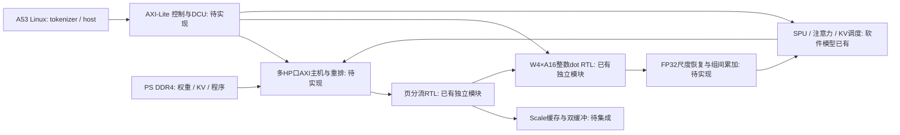

# Step 3 KV260 实施规格 v0.2

日期：2026-09-25。目标：KV260 上 Qwen3-1.7B、batch=1、持续解码 8–10 tokens/s。本文承接 P3 v0.1 软件样机，平台改为 KV260。性能数字均为待验证目标或模型预测；当前没有完整加速器 bitstream。

## 1. 已落地的边界

当前交付包含软件 VPU/SPU/MMU/DCU、K26 平台预算、分块 RTN 权重导出、二进制指令与镜像校验、软件执行器、两类独立 RTL 核及仿真、叶模块 Vivado 综合入口和板卡环境采集脚本。

完整 SPU/DCU RTL、浮点尺度累加、AXI 读写主机、KV 硬件调度、PS/PL 系统集成与 Linux 驱动尚未实现；因此本版不能加载到板卡并运行完整 Qwen3。真实 checkpoint 精度、Vivado 综合/实现和上板性能也尚未验证。不能将 NumPy/C++ 仿真或解析 tok/s 当成板测。

## 2. KV260 平台约束

| 项目 | 选定值 / 约束 |
|---|---|
| 器件 | XCK26-SFVC784-2LV-C；不使用普通 ZU5EV 代替器件/引脚定义 |
| 片上资源 | 117,120 LUT、234,240 FF、1,248 DSP、144 BRAM36、64 URAM288；容量不能替代端口/布线评估 |
| DDR | 板载 4GB、64bit DDR4；2400 MT/s 对应 19.2 GB/s 理论峰值 |
| 初始计算时钟 | 200 MHz 是实现目标，待布局布线确认 |
| 初始访存预算 | 4 个 HP 端口，每口128bit@200MHz时，合计原始上限12.8 GB/s；还要计效率、仲裁和CPU竞争 |
| 软件分页 | 8 KiB、按页对齐；这是镜像格式，不承诺等于实物DDR行长 |
| 权重 | 组大小128、主体W4、lm_head W4或W8、FP16 scales，初始为RTN |
| 激活 / KV | BFP16尾数输入；组内整数点积、组间FP32；KV8+FP16 scales |
| 第一阶段上下文 | 1024；另测2048/4096；性能必须带上下文长度 |
| 控制侧 | Cortex-A53/Linux负责tokenizer、chat template和应用；PL负责最终确定的硬件算子 |

依据：[AMD K26 DS987](https://docs.amd.com/r/en-US/ds987-k26-som)、[官方KV260资源表](https://xilinx.github.io/kria-apps-docs/kv260/2021.1/build/html/docs/nlp-smartvision/docs/hw_arch_accel_nlp.html)、[PS–PL接口PG201](https://docs.amd.com/r/en-US/pg201-zynq-ultrascale-plus-processing-system/Slave-Interface)、[官方器件选择示例](https://github.com/Xilinx/xup_high_level_synthesis_design_flow)。2400MT/s与19.2GB/s亦见[Hummingbird平台配置](https://arxiv.org/html/2507.03308v2#S5)。实物系统时钟和配置需上板核验。

有效带宽预算取：

```text
B_effective = min(DDR_peak × DDR_efficiency,
                  HP_ports × HP_width/8 × HP_clock × AXI_efficiency)
```

DDR效率与AXI效率分别代表各自约束，不在没有实测依据时一并当作接近100%。模型报告由 `step3/kv260_report.py` 生成。流水线利用率、SPU吞吐和FP32累加反馈也是目标假设。

P3的“一个DSP拆成多路18×9”不能带入DSP48E2资源预算。现有整数RTL由综合工具映射；没有综合报告前不报告实际DSP占用。首版32路dot核用于正确性验证，不能据此宣称已具备平台预算中的128路持续吞吐。

## 3. 计划中的系统与已实现部分



`page_demux`只处理有序输入流，既不发AXI请求，也不负责跨端口重排。`w4a16_dot`只输出128个乘积的精确INT32组和；不包含BFP量化、FP16 scale、FP32累加、GEMV全矩阵控制或注意力。SPU的NumPy exp/rsqrt与未来AMD浮点IP未建立逐位等价关系，要用误差预算单独验证。

## 4. DDR / DMA 契约

镜像内的offset以字节计；ISA地址字段以64B计。未来硬件必须使用 `physical_address = IMAGE_BASE + (instruction.addr << 6)`，并用足够宽的地址加法器保留高位。Linux虚拟地址不能直接作为AXI地址；板卡驱动应通过DMA API取得device address并处理cache一致性。

8KiB软件页必须拆成不跨4KiB边界的AXI4 INCR burst，单burst不超过256beats。128bit口对应16B/beat；从4KiB对齐地址读取8KiB，最大burst长度下至少分成两个请求。可执行描述符规格见 `step3/kv260/axi_plan.py`。控制器可用的outstanding深度与实际burst长度需测试，不把8KiB页当成一次AXI burst。

多口映射先采用确定的分块分配，给每个块保留顺序号；返回后按页流顺序进入demux。跨端口响应无统一顺序，不能依赖DDR返回恰好有序。每次搬运要检查RRESP/BRESP、RLAST、超时与复位后的未完成事务。

约1GB以上的模型镜像不能假定通过一次 `pynq.allocate()` 成功获得连续内存。最终运行时应选择经过验证的scatter-gather/分段DMA，或在系统镜像中规划足够的保留内存及驱动；这项选择等板上系统确定后完成。`manifest.json`的容量不等于Linux DMA内存可用量。权重保持DDR常驻，禁止把逐token从SD/主机搬运权重算作预期高速路径。

## 5. 模型与数值验证

1. 输入仅接受本地官方未量化Qwen3 checkpoint的F32/F16/BF16 safetensors；验证config、张量shape和字节范围。不把现成GPTQ qweight文件解释成浮点权重。
2. 导出器以S页覆盖的group为单位读源矩阵，避免一次复制整张embedding。权重按RTN量化；manifest明确 `calibrated_gptq=false`。
3. tied embedding与lm_head共用矩阵。W4或W8输出头必须纳入内存、访存和精度评估。
4. 软件baseline需分别测原始权重、量化权重、KV量化和数据通路误差。现有随机小模型回归只能验证数值/调度实现，不能证明真实Qwen质量。
5. `run_bundle.py --reference` 对同一token序列比较原始FP32参考与样机logits、top1、下一token NLL；它报告合并误差，不自动分解各量化误差，也不等于完整语料困惑度测试。
6. 实际质量验收使用固定中文任务集与固定tokenizer/chat template；记录量化前后指标。关闭thinking降低应用输出长度，但不改变每个decode token的基本访存成本。

Qwen3必须保留Q/K Norm、RoPE参数、GQA、SwiGLU、残差和输出head；不能只把LLaMA权重换成Qwen。依据：[官方Qwen3配置](https://huggingface.co/Qwen/Qwen3-1.7B/blob/main/config.json)。

## 6. 后续上板顺序及通过条件

| 阶段 | 交付物 | 通过条件 |
|---|---|---|
| M0 环境 | KV260系统/固件/工具版本、`board_probe.json`、可重建PS preset | 正常启动、SSH和文件校验可用；记录实际DDR与PL时钟 |
| M1 访存 | 多HP读写测试IP、驱动、带宽报告 | 1/2/4口、burst和outstanding扫参；顺序读+KV写、CPU并发均测；传输校验无错误 |
| M2 数值核 | 页分流、dot、scale累加、SPU的RTL仿真及综合 | 定点部分逐位一致；浮点部分有已批准误差门限；资源与时序报告完整 |
| M3 单层 | 完整attention/FFN、KV写读、DCU硬件 | 与软件中间张量比较，覆盖pos0、跨页、长上下文、复位/超时 |
| M4 全模型 | 28层+lm_head+host tokenizer+runtime | 同一真实checkpoint可端到端生成；质量退化有量化指标 |
| M5 性能 | 固定输入集、多次运行、温度/功耗/延迟原始记录 | batch1、1024上下文持续decode ≥8 tokens/s为最低目标，10为优化目标；分别报告TTFT与prefill |

正式速度计时包括输出head、采样/同步和每token的必要传输，不只测GEMV核。冷启动/模型装载与热推理解码分开记录；至少提供32/128/512-token prompt和128-token输出、以及1024/2048/4096上下文下的结果。若4口实测带宽或计算吞吐不足，先通过profile定位，不用修改预测参数代替优化。

本研究阶段使用独立LLM overlay。视觉DPU的同时驻留、共享DDR和应用争用都需要联合实现/实测，当前不承诺与智能家居视觉主线并发。

## 7. 当前外部依赖

用户确认板卡环境尚未准备好；本机未发现可用Vivado/Vitis。继续到完整部署需要KV260启动环境、工具版本与器件支持、真实Qwen3权重，以及余下硬件/驱动实现。工程不会生成占位bitstream、伪造寄存器地址或宣称已经完成板测。
